<a name="readme-top"></a>

[![Contributors][contributors-shield]][contributors-url]
[![Forks][forks-shield]][forks-url]
[![Stargazers][stars-shield]][stars-url]
[![Issues][issues-shield]][issues-url]
[![Christmas][Christmas]][Christmas-url]


<!-- PROJECT LOGO -->
<br />
<div align="center">
  <p>
    
  </p>

<h3 align="center">Carmony</h3>

  <p align="center">
    A free consumer-first, automotive marketplace. No tricks, no games, and no barriers to entry. Sell your car, your way.
    <br />
    <a href="https://github.com/ahadsyed2/CSC190-191-RUNTIME-TERRORS-MASTER/tree/main/website"><strong>Explore the Project »</strong>       </a>
    <br />
    <br />
  </p>
</div>


<!-- TABLE OF CONTENTS -->
<details>
  <summary>Table of Contents</summary>
  <ol>
    <li>
    <a href="#preface">Preface</a>
    </li>
    <li>
    <a href="#about-the-project">About The Project</a>
      <ul>
        <li><a href="#built-with">Built With</a></li>
      </ul>
    </li>
    <li>
      <a href="#developer-instructions">Developer Instructions</a>
      <ul>
        <li><a href="#prerequisites">Prerequisites</a></li>
        <li><a href="#installation">Installation</a></li>
      </ul>
    </li>
    <li><a href="#usage">Usage</a></li>
    <li><a href="#testing">Testing</a></li>
    <li><a href="#roadmap">Roadmap</a></li>
    <li><a href="#deployment">Deployment</a></li>
    <li><a href="#license">License</a></li>
    <li><a href="#supported-platforms">Supported Platforms</a></li>
    <li><a href="#additional-information">Additional Information</a></li>
  </ol>
</details>

<!-- PREFACE -->
## Preface

This is a student senior project for the California State University of Sacramento. Any and all development of this project will end by May 12th, 2024. 


<!-- ABOUT THE PROJECT -->
## About The Project

Carmony is a second-hand automotive retail marketplace aiming to create a consumer-friendly alternative in the online space. Carmony removes initial or recurring fees from private individuals just trying to access the site. Instead, the large focus on getting partnered dealerships involved allows the burden of operation to be shifted. The focus on connecting private individuals and dealerships also allows for a more secure, online individual-to-business opportunity instead of the oversaturated individual-to-individual ecosystems. Additionally, Carmony is focused on protecting sensitive user data from data harvesters, unlike other competitors. 

<p align="right">(<a href="#readme-top">back to top</a>)</p>


### Built With

* [![MongoDB][MongoDB]][MongoDB-url]
* [![Express][Express.js]][Express.js-url]
* [![React][React.js]][React-url]
* [![Node][Node.js]][Node.js-url]
* [![vsc][vsc]][vsc-url]

<p align="right">(<a href="#readme-top">back to top</a>)</p>


<!-- Dev Instructions -->
## Developer Instructions

To get a local copy up and running, complete the following steps. 
However, please note that this project is still in active development. Prerequisites and installation instructions are still being iterated upon and will be updated once they are in a stable position.

### Prerequisites

Make sure to have Express.js, React, and Node.js installed to their latest versions
  ```sh
  npm install npm@latest -g
  npm install express
  npm install react
  ```
Make sure to create your own MongoDB deployment and follow their connection instructions for connecting to MongoDB by 'Driver' and receive your connection string. 
Additionally, install the MongoDB extension on your IDE. For Visual Studio Code proceed with the following:
1. Open VSC
2. Click extensions on the left menu bar
3. Search for MongoDB in the search bar and click install
4. Copy your connection string and authentication information into the ".env" file in the backend folder [here](https://github.com/ahadsyed2/CSC190-191-RUNTIME-TERRORS-MASTER/blob/main/website/backend/.env).

If you do not have Node.js or the Node Package Manager installed, you can download them [here](https://nodejs.org/en). NPM comes with Node.js so there is no need to worry about a second download. 

<!-- INSTALLATION -->
### Installation

Installation Packages pending...
Please wait for updates...
   

<p align="right">(<a href="#readme-top">back to top</a>)</p>


<!-- USAGE EXAMPLES -->
## Usage

To run the program in a testing environment, you must have followed the **Prerequisites** and **Installation** instructions. 
| :warning: It is your responsibility to ensure your environment, database connection, extensions, and installed software are all correctly installed before using the program. Otherwise, the program will not work. :warning: |
| --- |

1. Open your development environment
2. Using the terminal, move into the ***backend*** folder and run
```
npm start
```
3. Open up a second shell in your terminal and repeat the same command but inside of the ***frontend*** folder
4. A web browser window should automatically open with the locally running program with an active connection to your MongoDB database. 

<p align="right">(<a href="#readme-top">back to top</a>)</p>

<!-- screenshot of product -->
## A screenshot of our product
  - **1. Homepage**
     - Upon accessing the carmony website users are presented with a feature-rich homepage designed to cater to their vehicle search needs. The homepage offers a comprehensive array of navigation options, allowing users to seamlessly explore and discover vehicles based on their preferences and requirements (Figure 1).
     - Furthermore, users can access detailed vehicle information by clicking on the vehicle of interest directly from the homepage. This action directs them to a dedicated vehicle information page that provides comprehensive details about the selected vehicle (Figure 2). This feature enables users to easily explore and know more about specific vehicles they are interested in.

<p align="center">
  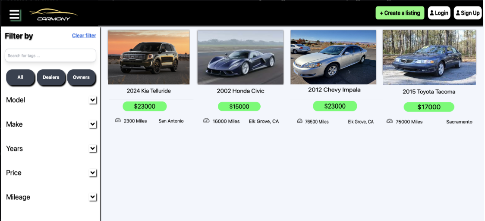
</p>
<p align="center">Figure 1: Homepage</p>

<p align="center">
  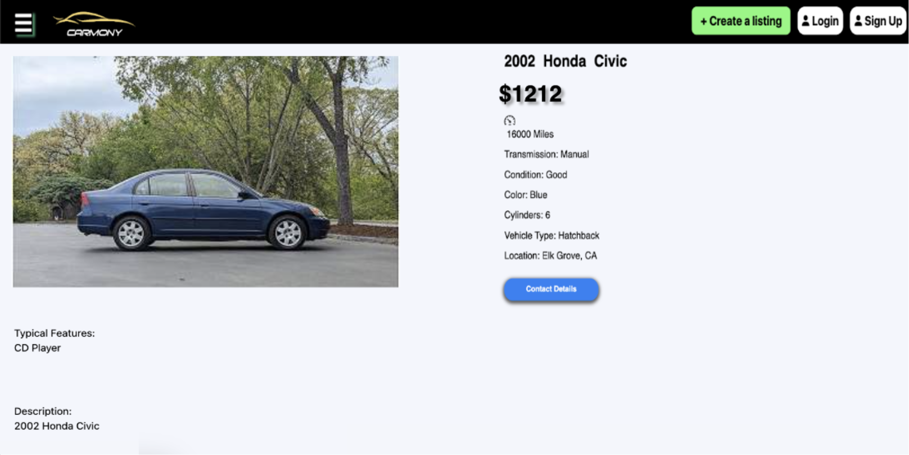
</p>
<p align="center">Figure 2: Vehicle Information page</p>

  - **2. Navigation**
    - Users can access the Hamburger menu by clicking on the icon located on the homepage, which facilitates navigation to various menu options (Figure 3).
    - If a user attempts to create a listing without being logged in, clicking the Create a listing button will redirect them to the Login page (Figure 4).
    - If users already have an account, they can click on the Login button to access their dashboard (Figure 4).
    - Additionally, individuals classified as Owners or Dealers who do not yet have accounts can sign up by clicking the Sign Up button on the homepage. (Figure 5).

<p align="center">
  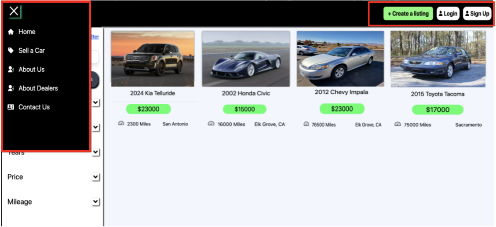
</p>
<p align="center">Figure 3: Navbar</p>

<p align="center">
  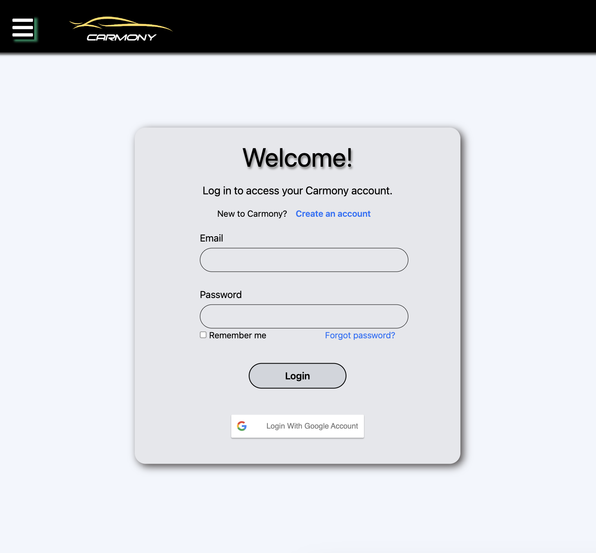
</p>
<p align="center">Figure 4: Login</p>

<p align="center">
  
</p>
<p align="center">Figure 5: Signup</p>

  - **3. Filter options**
    - Users have the ability to filter vehicles on the homepage by utilizing various 
search functionalities. For instance, entering "Chevy" into the search bar will display relevant vehicles matching the search criteria (Figure 6).
    - Additionally, users can refine their search further by utilizing dropdown filters for make, model, year, price, and mileage options (Figure 7). This enhances the browsing experience by allowing users to tailor their vehicle search according to specific preferences.

<p align="center">
  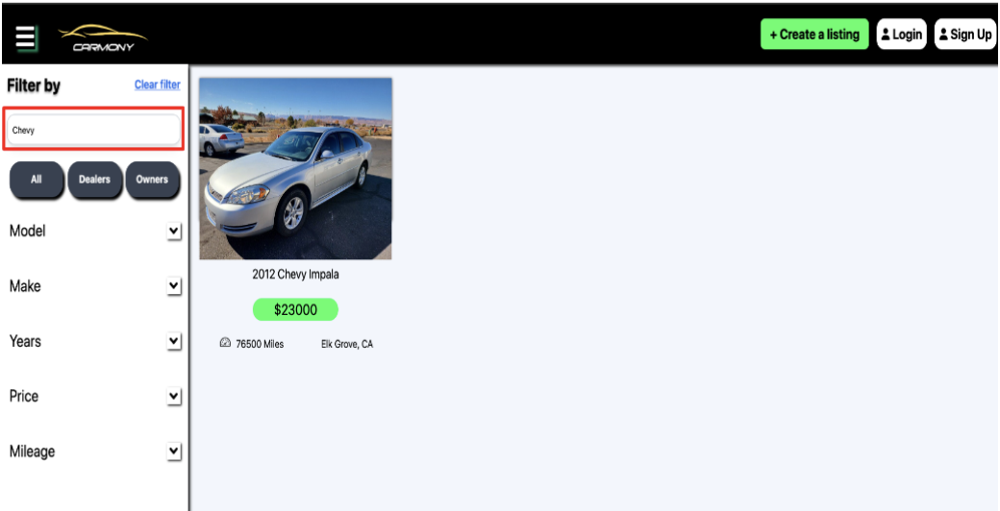
</p>
<p align="center">Figure 6: Search Bar</p>

<p align="center">
  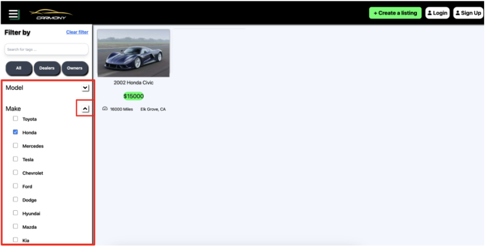
</p>
<p align="center">Figure 7: Filter by dropdown</p>

 - **4. Car Posting page**
     - After users log in or sign up on the Carmony website, they gain access to a feature allowing them to create car listings by selecting the 'Create a Listing' button. This page requires users to complete all required fields and upload a car image before final submission (Figure 8).

<p align="center">
  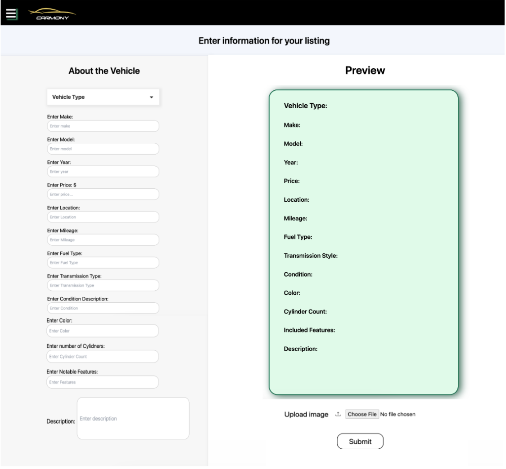
</p>
<p align="center">Figure 8: Car Posting page</p>

 - **4. Profile page**
     - Users can access their profile by clicking on the 'Profile' button from the homepage. Within the profile page, users can view their current listings and have the ability to view, edit, and delete cars they have posted (Figure 9).

<p align="center">
  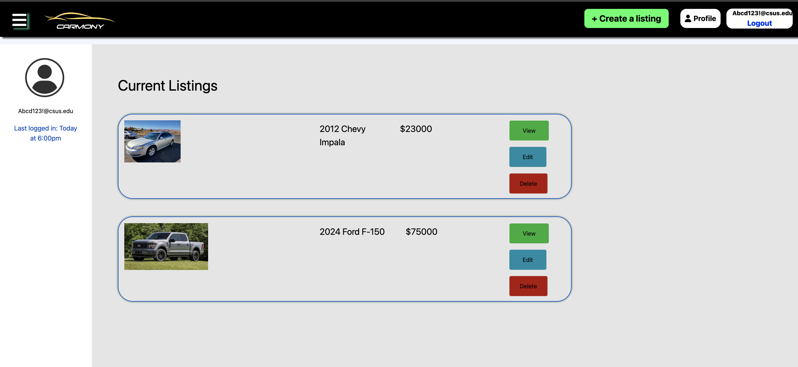
</p>
<p align="center">Figure 9: Car Posting page</p>


<p align="right">(<a href="#readme-top">back to top</a>)</p>

<!-- Testing -->
## Testing

### System Requirements

- **Install VS Code**:
  - Version: 1.88.0 (Universal)

- **Install Node.js**:
  - Version: v18.18.2

- **Install MERN Stack**:
  - Update npm to the latest version globally:
    ```bash
    npm install npm@latest -g
    ```
  - Install required packages:
    ```bash
    npm install express
    npm install react
    ```

- **Supported Operating Systems**:
  - Windows:
    - Windows 10 and 11
  - macOS:
    - macOS 10.15 (Catalina) and above (Intel or Apple Silicon 64-bit machines)

**Note**: All tests were performed on the supported operating systems mentioned above. 
  - Linux distributions or mobile devices are not tested nor officially supported.


### Testing React Applications with Cypress

To test React applications using the Cypress framework, follow these steps:

  - **Step 1: Initialize Package.json**:
    - Create a `package.json` file to track installed dependencies and manage your project's setup:
      ```bash
      npm init
      ```

  - **Step 2: Install Cypress**:
    - Cypress is shipped as a NodeJS package, you can use the npm command to install Cypress. 
       ```bash
      npm install cypress --save-dev
      ```

 - **Step 3: Open Cypress**:
    - When you install Cypress for the first time, cypress needs to create all required project folders and do the initial set up. 
      Cypress open command does all these. 
       ```bash
      npx cypress open
      ```

 - **Step 4: Configuring Cypress and Choose the Test Type**;
     - Once you type the cypress open command, the Cypress window opens and asks you to choose a set of options

 - **Step 5: Choose the Test Type**:
     - The welcome window shows two different types of tests, End to End Testing and Component Testing. In this case we are performing 
       UI end-to-end testing so you can choose the test type as E2E Tests. 

<p align="center">
  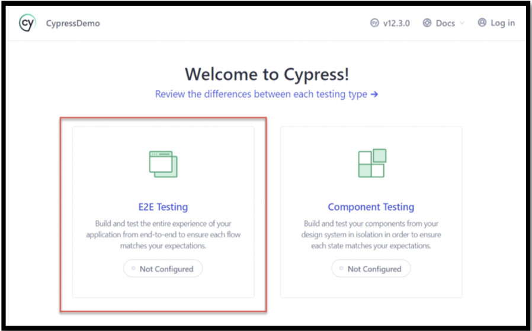
</p>

- **Step 6: Review the Configuration File and continue**;
     - The Cypress window shows that there are a set of configuration files that Cypress will create by default, you can review the 
       files and Click on Continue. 

<p align="center">
  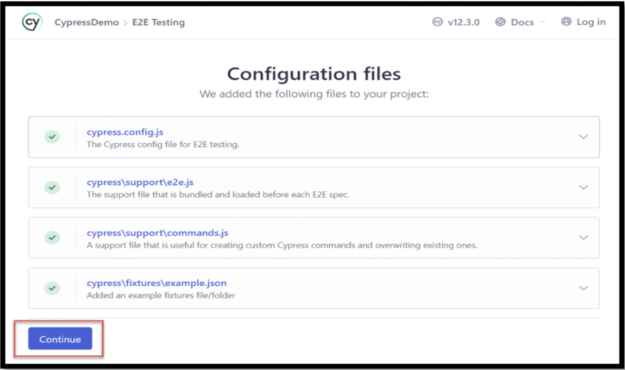
</p>

- **Step 7: Choose a browser**;
     - You can choose from the available browser; Cypress gathers information from all installed browsers in your System. If it 
       supports the Browser type and browser version, then it lists in the Choose a browser section. For simplicity, let’s choose 
       Chrome browser and Click on Start End to end Testing using Chrome. 
 
<p align="center">
  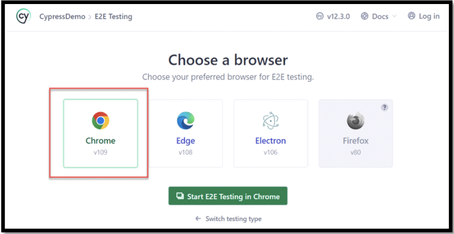
</p>

- **Step 8: Create First Spec window**;
     - Since you have created the fresh framework, you need to create the first spec, this also helps to verify if Cypress is installed 
       correctly and able to run our automated tests.
         - Click on Create a New Spec 
         - Enter any name (Example: posting.cy.js) 
         - Click on Okay, run the Spec

<p align="center">
  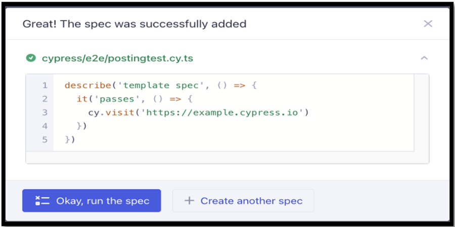
</p>

***Note***: By default, it adds the example test script, we can modify them later as per our use case or test scenario.

<p align="center">
  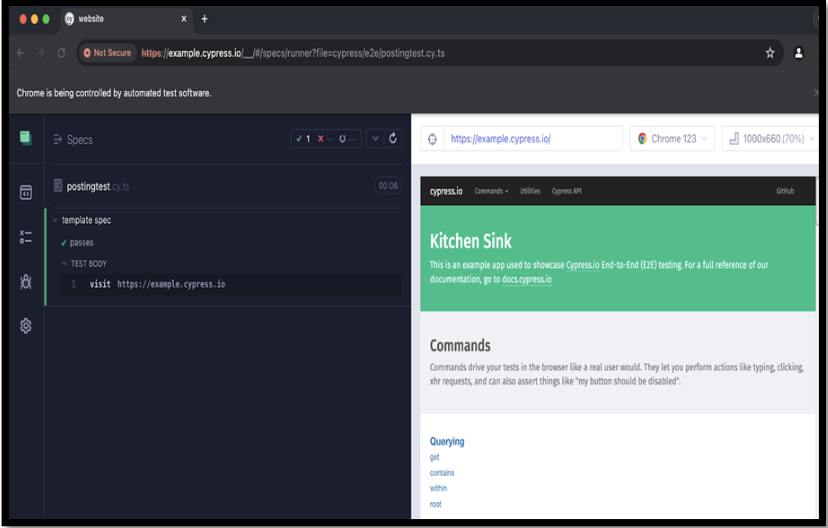
</p>

<p align="right">(<a href="#readme-top">back to top</a>)</p>


<!-- ROADMAP -->
## Roadmap

- [ ] Build out front-end more front-end interfaces
  - [ ] Profile, Create-a-post, edit-post, dealer sign-in / login, payment, "My Deals" manager pages
- [ ] Backend Connections
    - [ ] Finish connecting the front-end interface to the backend database for current pages
      - [ ] Repeat with each subsequent new page
    - [ ] Stress and optimization testing
    - [ ] Gather data to readjust hosting resource estimates
- [ ] UI Overhaul
    - [ ] Implement a CSS framework
    - [ ] Refine User experience and application flow
    - [ ] Establish a consistent style

See the [open issues](https://github.com/ahadsyed2/CSC190-191-RUNTIME-TERRORS-MASTER/issues) for a full list of proposed features (and known issues).

<p align="right">(<a href="#readme-top">back to top</a>)</p>


<!-- Deployment -->
## Deployment

Deployment date TBD

<p align="right">(<a href="#readme-top">back to top</a>)</p>

<!-- DIAGRAMS -->
## Diagrams
<p align="center">
  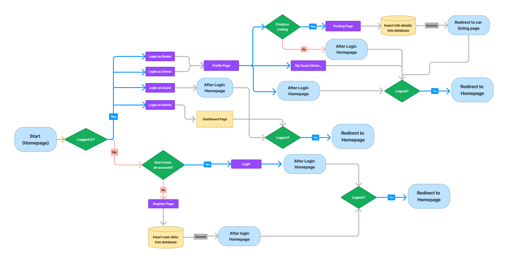
</p>
<p align="center">
  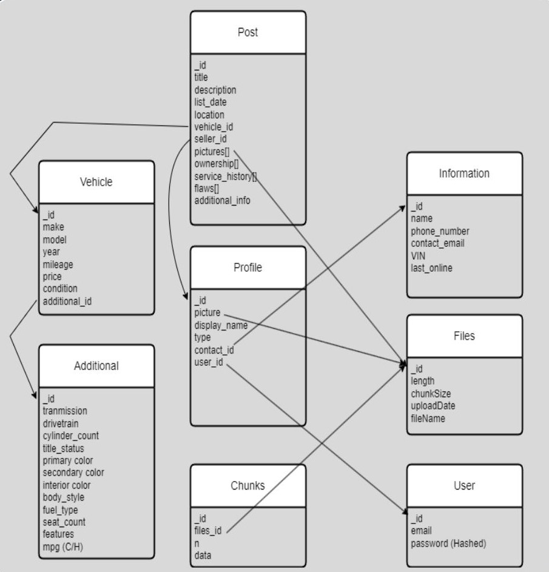
</p>

<p align="right">(<a href="#readme-top">back to top</a>)</p>

<!-- SCREENSHOTS -->
## Screenshots
<p align="center">Current front-end UI (WIP)</p><p align="center">
    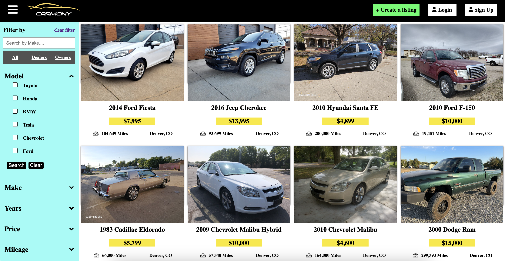
</p>


<!-- LICENSE -->
## License

No License is currently available nor is it guaranteed to be available. See `LICENSE.txt` for more information.

<p align="right">(<a href="#readme-top">back to top</a>)</p>


<!-- Supported Platforms -->
## Supported-Platforms

* **Windows 10/11** and **MacOS** are supported.
* Any widely used IDE should work but we are using [**VSC**](https://code.visualstudio.com/)


<p align="right">(<a href="#readme-top">back to top</a>)</p>


<!-- ACKNOWLEDGMENTS -->
## Additional-Information

* None Currently
<!--* []()
* []()
* []() -->

<p align="right">(<a href="#readme-top">back to top</a>)</p>


## Team Members and Contact
1. Jasmine Randhawa
2. Janeeya Chanta: janeeyachanta@csus.edu
3. Kailee Mukai
4. Nick Chace
5. Ahad Syed
6. Garret Learned
7. Sukhdeep Banwait
8. Haoyang Li  


<!-- MARKDOWN LINKS & IMAGES -->
<!-- https://www.markdownguide.org/basic-syntax/#reference-style-links -->
[contributors-shield]: https://img.shields.io/github/contributors/ahadsyed2/CSC190-191-RUNTIME-TERRORS-MASTER.svg?style=for-the-badge
[contributors-url]: https://github.com/ahadsyed2/CSC190-191-RUNTIME-TERRORS-MASTER/graphs/contributors
[forks-shield]: https://img.shields.io/github/forks/ahadsyed2/CSC190-191-RUNTIME-TERRORS-MASTER.svg?style=for-the-badge
[forks-url]: https://github.com/ahadsyed2/CSC190-191-RUNTIME-TERRORS-MASTER/network/members
[stars-shield]: https://img.shields.io/github/stars/ahadsyed2/CSC190-191-RUNTIME-TERRORS-MASTER.svg?style=for-the-badge
[stars-url]: https://github.com/ahadsyed2/CSC190-191-RUNTIME-TERRORS-MASTER/stargazers
[issues-shield]: https://img.shields.io/github/issues/ahadsyed2/CSC190-191-RUNTIME-TERRORS-MASTER.svg?style=for-the-badge
[issues-url]: https://github.com/ahadsyed2/CSC190-191-RUNTIME-TERRORS-MASTER/issues
[license-shield]: https://img.shields.io/github/license/ahadsyed2/CSC190-191-RUNTIME-TERRORS-MASTER.svg?style=for-the-badge
[license-url]: https://github.com/ahadsyed2/CSC190-191-RUNTIME-TERRORS-MASTER/LICENSE.txt
[linkedin-shield]: https://img.shields.io/badge/-LinkedIn-black.svg?style=for-the-badge&logo=linkedin&colorB=555
[linkedin-url]: https://linkedin.com/in/linkedin_username
[product-screenshot]: images/screenshot.png
[Christmas]:https://img.shields.io/badge/Days_until-Christmas-red?style=for-the-badge&labelColor=009c27&color=9c0a00
[Christmas-url]: https://www.calendarr.com/united-states/countdown/christmas-day/
[Next.js]: https://img.shields.io/badge/next.js-000000?style=for-the-badge&logo=nextdotjs&logoColor=white
[Next-url]: https://nextjs.org/
[React.js]: https://img.shields.io/badge/React-20232A?style=for-the-badge&logo=react&logoColor=61DAFB
[React-url]: https://reactjs.org/
[MongoDB]: https://img.shields.io/badge/MongoDB-4EA94B?style=for-the-badge&logo=mongodb&logoColor=white
[MongoDB-url]: https://www.mongodb.com/  
[Node.js]: https://img.shields.io/badge/Node.js-43853D?style=for-the-badge&logo=node.js&logoColor=white
[Node.js-url]: https://nodejs.org/en
[vsc]: https://img.shields.io/badge/Visual_Studio_Code-0078D4?style=for-the-badge&logo=visual%20studio%20code&logoColor=white
[vsc-url]: https://code.visualstudio.com/
[Express.js]: https://img.shields.io/badge/Express.js-404D59?style=for-the-badge
[Express.js-url]: https://expressjs.com/
[vsc]: https://img.shields.io/badge/Visual%20Studio%20Code-0078d7.svg?style=for-the-badge&logo=visual-studio-code&logoColor=white
[vsc-url]: https://code.visualstudio.com/
